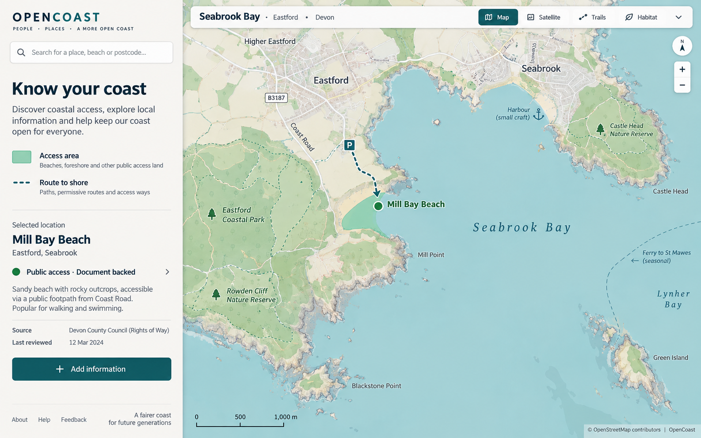
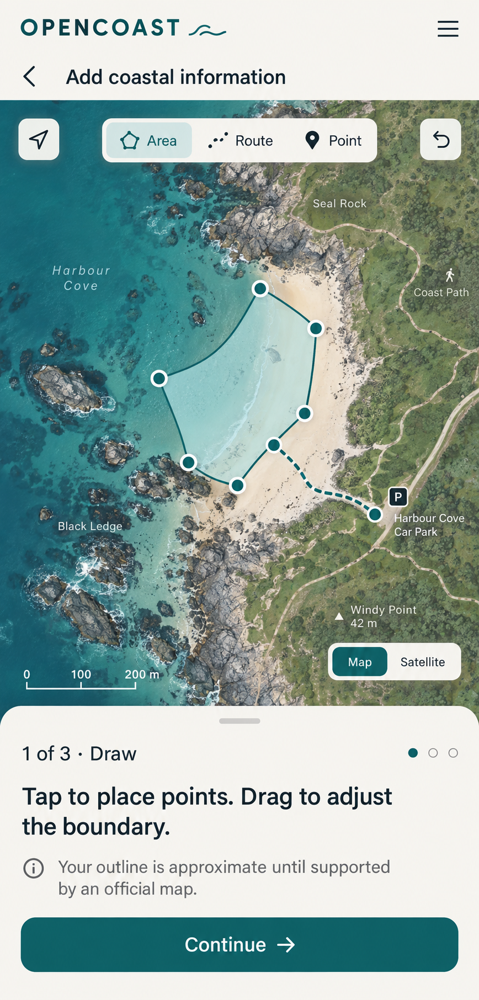

# Visual analysis for OpenCoast

The reference images were generated with the built-in image-generation tool for this project. They are design references, not map data and not production interface assets.

## Desktop map reference

- Map takes roughly three quarters of the width. A stable white left rail holds purpose, search, legend, selected record, and one primary contribution action.
- Palette: warm near-white `#F7F5EF`, deep blue-green `#0F585C`, charcoal `#203235`, pale water blue, and restrained mint access fills.
- Text hierarchy: wordmark and page title are prominent; map labels and record headline remain readable; metadata is visibly secondary but not tiny.
- Record details sit directly in the rail rather than in nested cards. Thin rules divide sections.
- The generated reference depicts fictitious access data. Production starts empty and must never display those example claims.

## Mobile drawing reference

- Map remains the dominant surface; controls use large touch targets.
- Drawing has an explicit mode choice for area, route, and point. Vertices are visible and adjustable. Undo is always available.
- The bottom sheet presents one step at a time and leaves the map visible above it.
- Hand-drawn geometry receives an approximate-boundary note. Satellite imagery is optional and must come from a properly licensed provider; the reference image itself does not supply imagery.

## Implementation translation

Use a responsive map shell with a desktop rail and mobile bottom sheet. Draw approved area, route, and point layers above a configurable vector basemap. Use color and line pattern together so status is distinguishable without color vision. Keep unreviewed locations visually quiet, with a clear no-information state in the record pane.
